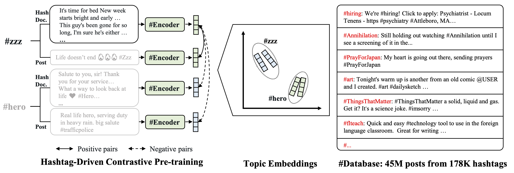

# HICL: Hashtag-Driven In-Context Learning for Social Media Natural Language Understanding
The official implementation of the paper HICL: Hashtag-Driven In-Context Learning for Social Media Natural Language Understanding

We aim to effectively retrieve external data and properly fine-tune bi-directional models to advance generic NLU on social media. 
We first pre-train an embedding model to help any social media post in context enriching by retrieving another relevant post; then, we insert trigger terms to fuse the enriched context for language models to refer to in semantics learning under sparsity. 
The framework can easily be plugged into various task-specific fine-tuning frameworks as external features and broadly benefits downstream social media tasks.

Fig.1 The workflow to pre-train #Encoder on 179M Twitter posts, each containing a hashtag. 
#Encoder was pre-trained on pairwise posts, and contrastive learning guided them to learn topic relevance via learning to identify posts with the same hashtag.
We randomly noise the hashtags to avoid trivial representation.



Fig 2. The workflow of HICL fine-tuning.
A tweet x is first encoded with \encoder{} and the output is then used to search the #Database to retrieve the most topic-related tweet x'. 
After that, x' and x are paired in concatenation and inserted with trigger terms for task-specific fine-tuning. 
Here HICL can both work for tweets with and without hashtags.


Our key contributions:
1. We propose a novel HICL framework for generic social media NLU in data sparsity, which can retrieve topic-related posts and enrich contexts via gradient-searched trigger terms.

2. We develop the first hashtag-driven pre-trained model, #Encoder, leveraging hashtags to learn inter-post topic relevance (for retrieval) via contrastive learning over 179M tweets.

3. We contribute a large corpus with 45M tweets for retrieval, and the experiments on 7 Twitter benchmarks show that HICL advances the overall results of various trendy NLU models.

# Environment
To run the code, please install the dependency packages by using the following command:
```
pip install -r requirements.txt
```
# Prepare the Datasets
Please refer to the official TweetEval sites to download the datasets:

Stance Detection (SemEval-2016 task 6), Emotion Recognition (SemEval-2018 task 1), Irony Detection (SemEval-2018 task 3), Offensive Language Identification (SemEval-2019 task 6), Hate Speech Detection (SemEval-2019 task 5), Humor detection (SemEval-2021 task 7),Sarcasm Detection (SemEval-2022 task 6).

# #Encoder
To encode a tweet with #Encoder:
```
from transformers import AutoModel, AutoTokenizer 
hashencoder = AutoModel.from_pretrained("albertan017/hashencoder")
tokenizer = AutoTokenizer.from_pretrained("albertan017/hashencoder")
tweet = "here's a sample tweet for encoding"
input_ids = torch.tensor([tokenizer.encode(tweet)])
with torch.no_grad():
    features = hashencoder(input_ids)  # Models outputs are now tuples
```

# Run HICL

# Main Results

# Citation

