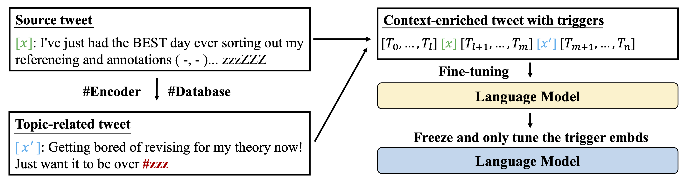
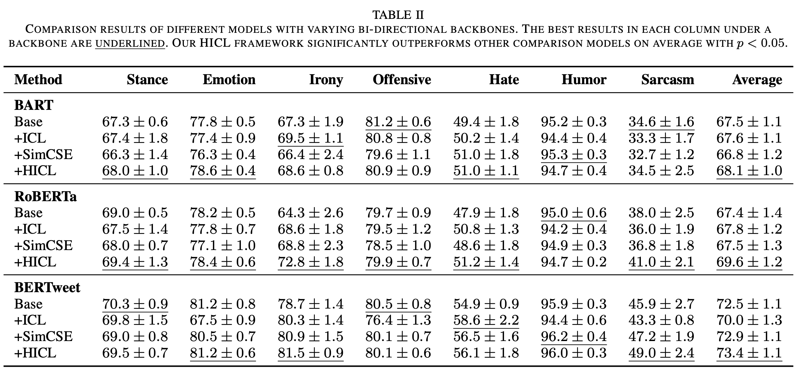

# HICL: Hashtag-Driven In-Context Learning for Social Media Natural Language Understanding
The official implementation of the paper HICL: Hashtag-Driven In-Context Learning for Social Media Natural Language Understanding

We aim to effectively retrieve external data and properly fine-tune bi-directional models to advance generic NLU on social media. 
We first pre-train an embedding model, #Encoder, to help any social media post in context enriching by retrieving another relevant post; then, we insert trigger terms to fuse the enriched context for language models to refer to in semantics learning under sparsity. 
The framework can easily be plugged into various task-specific fine-tuning frameworks as external features and broadly benefits downstream social media tasks.

Fig.1 The workflow to pre-train #Encoder on 179M Twitter posts, each containing a hashtag. 
#Encoder was pre-trained on pairwise posts, and contrastive learning guided them to learn topic relevance via learning to identify posts with the same hashtag.
We randomly noise the hashtags to avoid trivial representation.


Fig 2. The workflow of HICL fine-tuning.
A tweet x is first encoded with \encoder{} and the output is then used to search the #Database to retrieve the most topic-related tweet x'. 
After that, x' and x are paired in concatenation and inserted with trigger terms for task-specific fine-tuning. 
Here HICL can both work for tweets with and without hashtags.



Our key contributions:
1. We propose a novel HICL framework for generic social media NLU in data sparsity, which can retrieve topic-related posts and enrich contexts via gradient-searched trigger terms.

2. We develop the first hashtag-driven pre-trained model, #Encoder, leveraging hashtags to learn inter-post topic relevance (for retrieval) via contrastive learning over 179M tweets.

3. We contribute a large corpus with 45M tweets for retrieval, and the experiments on 7 Twitter benchmarks show that HICL advances the overall results of various trendy NLU models.

# Environment
To run the code, please install the dependency packages by using the following command:
```
pip install -r requirements.txt
```
# Prepare the Datasets
Please refer to the official TweetEval sites to download the datasets:

Stance Detection (SemEval-2016 task 6), Emotion Recognition (SemEval-2018 task 1), Irony Detection (SemEval-2018 task 3), Offensive Language Identification (SemEval-2019 task 6), Hate Speech Detection (SemEval-2019 task 5), Humor detection (SemEval-2021 task 7),Sarcasm Detection (SemEval-2022 task 6).

Please convert the data into {TASK}/train.json, {TASK}/dev.json, {TASK}/test.json with the format: {"labels": "0", "text": "text"}, and place them under "data" folder

# #Database
We will release the 45M #Database upon publication.

# #Encoder
To encode a tweet with #Encoder:
```
from transformers import AutoModel, AutoTokenizer 
hashencoder = AutoModel.from_pretrained("albertan017/hashencoder")
tokenizer = AutoTokenizer.from_pretrained("albertan017/hashencoder")
tweet = "here's a sample tweet for encoding"
input_ids = torch.tensor([tokenizer.encode(tweet)])
with torch.no_grad():
    features = hashencoder(input_ids)  # Models outputs are now tuples
```

# Run HICL
To run the baseline models, please run the bash run_baseline.sh:
```
bash run_baseline.sh
```

To run the HICL framework, first please run the data preprocess bash, run_HICL_preproecss.sh, it will search for the most topic-related tweets for the benchmark datasets.
```
bash run_HICL_preprocess.sh
```

Then run the bash, run_HICL.sh to reproduce the main results.
```
bash run_HICL.sh
```

# Main Results
The main comparison results for HICL is shown as below:


# Bugs or Questions
If you have any questions related to the code or the paper, feel free to email Hanzhuo Tan (hanzhuo.tan@connect.polyu.hk). If you encounter any problems when using the code, or want to report a bug, you can open an issue. Please try to specify the problem with details so we can help you better and quicker!

# Citation
```
@misc{tan2023hicl,
      title={HICL: Hashtag-Driven In-Context Learning for Social Media Natural Language Understanding}, 
      author={Hanzhuo Tan and Chunpu Xu and Jing Li and Yuqun Zhang and Zeyang Fang and Zeyu Chen and Baohua Lai},
      year={2023},
      eprint={2308.09985},
      archivePrefix={arXiv},
      primaryClass={cs.CL}
}
```


